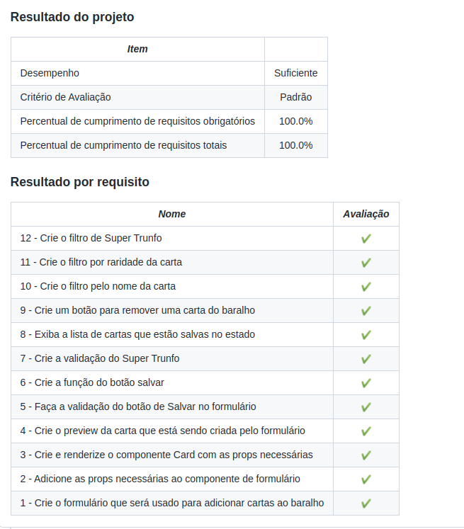

<h1>Sobre</h1>

Segundo projeto do módulo 2 - Front-end, da <a href="https://betrybe.com" target="_blank">Trybe!</a>

Dessa vez a proposta foi criar uma aplicação em que seria possível criar um deck de cartas ao estilo Super-Trunfo, passando informações ao preencher um formulário.

<h1>Instalando</h1>

Para instalar, basta executar o comando <code>npm install</code> no diretório raiz do projeto.

Logo depois execute o comando <code>npm start</code>

<h1>Tecnologias utilizadas</h1>

<ul>
  <li>React</li>
  <li>JavaScript</li>
</ul>

<h1>Nota</h1>

